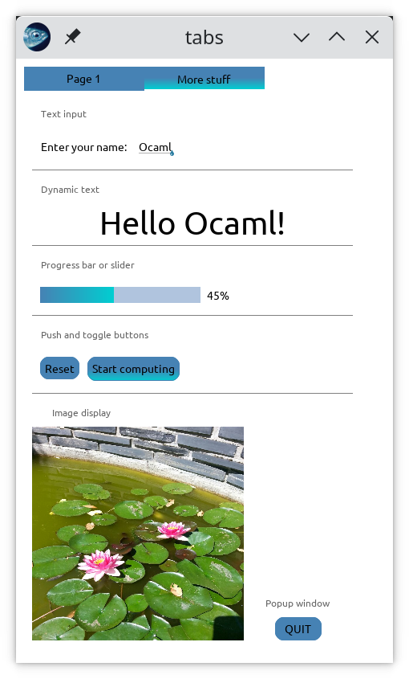

# bogue-demo
A demo program for the Bogue library

## How to run?

Compile and run with
```
dune exec ./bogue_demo.exe
```

You need `ocaml` and `dune`, of course, and the latest version of the
`bogue` library, see [here](https://github.com/sanette/bogue)


## Screenshots




See also this [video](https://youtu.be/isFLxnDooL8).
